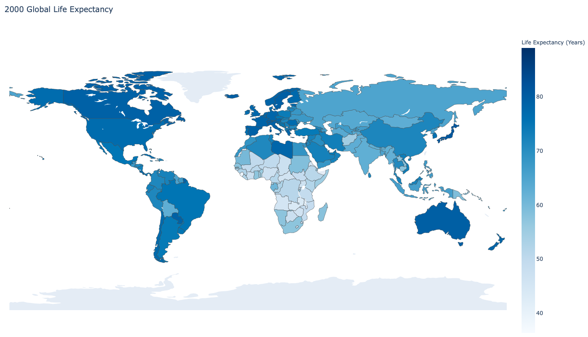

# 🌎 Life Expectancy Analysis 
The purpose of this project is to analyze features affecting the life expectancy (LE) of 197 countries around the world, and to determine whether there exists a set of features correlated strongly enough to LE to enable formulation of a multiple linear regression (MLR) model for prediction. 

## TL;DR:
- Both the average LE of 'Developed' and 'Developing' countries have steadily increased from 2000 to 2015, but there's greater LE variation amongst 'Developing' countries.
- With the exception of Japan 🇯🇵 in 2000 and New Zealand 🇳🇿 in 2010, every year (from 2000-2015) the country with the longest LE is European.
- There are 9 countries whose LE decreased between 2000 and 2015 despite steady or decreasing rates of mortality in the under-five population. 
- The MLR model with the highest R² was that which was trained on the following 4 features: *infant_deaths*, *hiv/aids*, *schooling*, and *status*.
- A more reliable Life Expectancy Predictor could probably be achieved through a non-linear model and its worth exploring as a next step.

## Data Preprocessing & Preliminary Analysis:
The data was collected by the World Health Organization (WHO) and the dataset was sourced from [Kaggle](https://www.kaggle.com/kumarajarshi/life-expectancy-who). It contains the following information for 197 countries over 16 years:
- **country**: Name of the country. 
- **year**: Year in range [2000, 2015].
- **status**: 'Developed' or 'Developing'.
- **life_expectancy**: Life expectancy of a country's citizens. 
- **adult_mortality**: Number of deaths of people aged 15-60 per 1000 population.
- **infant_deaths**: Number of infant deaths per 1000 live births (death before age 1).
- **alcohol**: Per capita (ages 15+) consumption (in liters of pure alcohol). 
- **percentage_expenditure**: Expenditure on health as % of GDP per capita.
- **hepatitis_b**: Immunization rate among 1-year-olds.
- **measles**: Number of reported cases per 1000 population.
- **bmi**: Average BMI of population.
- **under-five_deaths**: Number of under-five deaths per 1000 population.
- **polio**: Immunization rate among 1-year-olds.
- **total_expenditure**: Government expenditure on health as a % of total government expenditure.
- **diphtheria**: Immunization rate among 1-year-olds.
- **hiv/aids**: Death rate (0-4 year-olds) due to HIV/AIDS per 1000 live births.
- **gdp**: GDP per capita.
- **population**: population. 
- **thinness_10-19_years**: Rate of thinness among adolescents (age 10-19). Thinness is defined as having a BMI < 2 standard deviations below the median.
- **thinness_5-9_years**: Rate of thinness among children (age 5-9). Thinness is defined as having a BMI < 2 standard deviations below the median.
- **income_composition_of_resources**: Human Development Index (between 0-1) in terms of income composition of resources.
- **schooling**: Average number of years of schooling.

There are numerous, obvious inaccuracies in this raw dataset. For instance, *infant_deaths* and *under-five_deaths* for many countries are recorded as being 0 every year, thinness rates and *adult_mortality* within a single country are recorded in some cases as fluctuating by ~1000% from one year to the next, and bmi is recorded as being up to 77.6. There are also glaring outliers in immunization rates. For instance Denmark's diphtheria immunization rate from 2000-2015 ranges between 91 and 98 with the exception of 2010 where it's recorded as being just 9. In order to generate a more reliable model I decided to update the dataset by mining the following features' data from the Global Health Observatory data repository on the [WHO website](https://www.who.int/data/gho): *hepatitis_b, diphtheria, polio, thinness_10-19_years, thinness_5-9_years, adult_mortality, infant_deaths, and under_five_deaths*.

In addition to updating the aforementioned quantifiable features, I updated the categorical *status* feature. There are only 32 countries characterized as 'Developed', while the rest are 'Developing' (82.5%). The fact that there's 62 'Developing' countries with higher life expectancies than some 'Developed' countries suggests that some countries may be incorrectly classified. Sure enough, Canada, France and Finland, to name a few, are classified as 'Developing'. Seeing as how there's no established convention for the designation of a country as "developed" I changed the *status* of a country from 'Developing' to 'Developed' if it is classified as having a high per capita gross national income ([GNI](https://www.un.org/en/development/desa/policy/wesp/wesp_current/2014wesp_country_classification.pdf)). The status of 19 countries were updated: Bahrain 🇧🇭, Barbados 🇧🇧, Brunei Darussalam 🇧🇳, Canada 🇨🇦, Chile 🇨🇱, Estonia 🇪🇪, Finland 🇫🇮, France 🇫🇷, Greece 🇬🇷, Israel 🇮🇱, Kuwait 🇰🇼, Oman 🇴🇲, Qatar 🇶🇦, Republic of Korea 🇰🇷, Russian Federation 🇷🇺, Saudi Arabia 🇸🇦, Trinidad and Tobago 🇹🇹, United Arab Emirates 🇦🇪, Uruguay 🇺🇾. The resulting status breakdown:

### Formatting 
Prior to analyzing the updated data, the feature names were standardized (striped of trailing whitespace, made lowercase, and spaces were replaced by '_'), and, in the case of one feature, renamed to be more accurately descriptive: *thinness_1-19_years* was replaced by *thinness_10-19_years*. Furthermore, 7 of the longest country names were made shorter to ensure they will fit on future generated graphs. For instance "Venezuela (Bolivarian Republic of)" was replaced with "Venezuela".

### Addressing Missing Data & Outliers
There are 10 countries in the dataset for which data was only collected (partially) in 2013. These were removed from the dataset, along with the BMI feature column, which illogically contains 1132 entries (39% of all BMI entries) greater than 50. 
Next, missing values (NaN) were interpolated first by country and then by year. The second interpolation is necessary since there are cases in which specific feature data wasn't recorded for a particular country and the first interpolation is thus ineffective. For instance, *total_expenditure* data is missing for North Korea for all years.
Lastly, two features' values were windsorized to mitigate outlier effects. The *percent_expenditure* feature is particularly skewed since there were 26 countries for which 0 was recorded as the *percent_expenditure* in every year spanned by the dataset. The second feature is *hepatitis_b*.

## Exploratory Data Analysis:

### Changes Across Years:
- Zimbabwe 🇿🇼 experienced the largest increase in life expectancy between 2000 and 2015: 21.0 years

- The countries that experienced a decrease in life expectancy between 2000 and 2015: Estonia 🇪🇪, Grenada 🇬🇩, Iraq 🇮🇶, Libya 🇱🇾, Paraguay 🇵🇾, Romania 🇷🇴, Saint Vincent and the Grenadines 🇻🇨, Syrian Arab Republic 🇸🇾, Yemen 🇾🇪

- Of the 10 countries with the highest LE in 2000, 5 were amongst the highest 10 in 2015: Switzerland 🇨🇭, Japan 🇯🇵, Australia 🇦🇺, Spain 🇪🇸, Iceland 🇮🇸

- With the exception of Japan 🇯🇵 in 2000 and New Zealand 🇳🇿 in 2010, every year the country with the longest LE is European 

- Sierra Leone 🇸🇱 has consistently had a comparatively short LE

- Both the average LE of 'Developed' and 'Developing' countries have steadily increased from 2000 to 2015, but the error lines on the 'Developing' bars are longer. In other words, theres greater variation in LE of 'Developing' countries than 'Developed' countries.

- From the following histogram we can see that there was an increase in LE from 2000 to 2015, and the variation in LE between countries decreased. These trends are also visible in the relative shading of the subsequent world maps.

 

### Observations From Most Recent Year:
- Sierra Leone 🇸🇱 had the lowest life expectancy of any country in 2015: 51.0 years

- Slovenia 🇸🇮 had the highest life expectancy of any country in 2015: 88.0 years

- Trinidad and Tobago 🇹🇹 was the 'Developed' country with the lowest life expectancy in 2015: 71.2 years

- Number of 'Developing' countries with life expectancies ≥ one or more 'developed' countries in 2015: 59

### To Generate All Graphs:
    python graph_generator.py

### To Generate a Markdown File (Global_Life_Expectancy_Analysis.md) with Summary of the Above Analysis:
    python analysis.py

## Questions Stemming from Data Analysis
1. Why did 9 countries experience a decrease in life expectancy between 2000 and 2015? Can we learn from trends in the feature data of these countries how to increase life expectancy?
    - One hypothesis was that the immunization rates of 1-year-olds in these countries decreased, causing a decline in LE. This hypothesis isn't strongly supported by the following graph, which shows that aside from significant decreases in the immunization rates of Polio and Diphtheria in the Syrian Arab Republic, and moderate decreases in the immunization rates of these two diseases in Iraq, immunization rates for all 3 diseases remained relatively constant from 2000-2015 in every country. In some cases the immunization rates actually increased. 
    

    - Two other hypothesis were that rates of malnutrition increased, which would contribute to early death, and that younger people were dying at greater rates, bringing down the average life expectancy. Neither of these appear to be directly responsible for the observed decreased life expectancy of the nine countries:
    
    

2. What are the countries with high life expectancy doing right? Can we learn from trends in the feature data of these countries how to increase life expectancy?
    - One hypothesis was that these countries are investing more money in healthcare. This hypothesis isn't supported by the following graph which plots government healthcare spending as a percentage of total government spending against life expectancy for 20 countries with the highest government healthcare spending as a percentage of total in 2015. 
    - The main takeaway from this graph and the subsequent world maps is that the Unites States Government directs disproportionately more of it's budget to healthcare than other countries. Also, government healthcare spending as a % of total doesn't appear to be linearly correlated to life expectancy. 

    

     

## Feature Analysis
The following heatmap shows the correlation strength of the dataset features with *status* separated into it's two possibilities: 'Developed' and 'Developing'. In regards to the target variable, Life Expectancy, it appears as though:
1. LE is strongly negatively (< -0.65) correlated to *adult_mortality*, *infant_deaths*, and *under_five_deaths*
2. LE is strongly positively (> 0.65) correlated to *income_composition_of_resources* and *schooling*
3. LE is not correlated with *population*

There's high positive correlation between the following feature pairs:
1. *income_composition_of_resources* and *schooling*
2. *thinness_5-9_years* and *thinness_10-19_years*
3. *under-five_deaths* and *infant_deaths*
4. *under-five_deaths* and *adult_mortality*
5. *infant_deaths* and *adult_mortality*
6. *hiv/aids* and *adult_mortality*
7. *polio* and *hepatitis_b*
8. *diphtheria* and *hepatitis_b*
9. *polio* and *diphtheria*

There's high negative correlation between the following feature pairs:
1. *income_composition_of_resources* and *infant_deaths*
2. *schooling* and *infant_deaths*
3. *polio* and *infant_deaths*
4. *diphtheria* and *infant_deaths*
5. *income_composition_of_resources* and *under-five_deaths*
6. *schooling* and *under-five_deaths*
7. *polio* and *under-five_deaths*
8. *diphtheria* and *under-five_deaths*
9. *Developing* and *Developed*

## Feature Selection
Backward selection was performed on the numerical features until there was no observed improvement in the model's **Root Mean Squared Error (RMSE)** nor **R²**. The strongest model was that which was trained on all features with an absolute correlation strength ≥ 0.5 to LE, minus the highly correlated features among them. In other words, *adult_mortality, under-five_deaths, polio, diphtheria, thinness_10-19_years, thinness_5-9_years, income_composition_of_resources*, and *Developing* weren't used to train the final model in because even though they're highly correlated to LE, they're also extremely highly correlated to other features being used to train the model and led to a huge **Cond. No.** score (explained more later). 

    Model: LE = 74.12642629503976 + (-0.23545478)*infant_deaths + (-0.48803017)*hiv/aids + (0.21016012)*schooling + (2.41789441)*Developed

- Intercept: 74.12642629503976
- Coefficients: [-0.23545478 -0.48803017  0.21016012  2.41789441]
- R²: 0.8972851831156454
- Mean Squared Error (RSE): 8.753109188956723
- Root Mean Squared Error (RMSE): 2.9585653937266154
- Mean Absolute Error: 2.3170281669067276

The regression results were obtained through two methods: **SciKit Learn** and **StatsModels**. sklearn was used to evaluate the regression's predictive strength (MSE, RMSE, MAE), while StatsModels provided insights regarding the model. Both gave the same intercept and coefficients.  

### F-test
One of the questions asked prior to feature selection was whether there's at least one feature useful in predicting life expectancy. The null hypothesis was that there isn't--in other words, all feature coefficients are 0. The alternative hypothesis is that there is at least one non-zero coefficient. The **F-statistic** provided in the "OLS Regression Results" StatsModels summary is much larger than 1 and thus provides strong evidence against the null hypothesis, increasing our confidence that at least one feature is useful in predicting life expectancy.  

### Analysis of OLS Regression Results
With the OLS Regression Results summary we can determine whether we should have confidence in the model. 
Negatives:
 1. **Omnibus** is a test of skewness and kurtosis ("tailedness"). We want a value close to 0 which would indicate that the errors are normally distributed across the data. 
 2. **Prob(Omnibus)** indicates the probability that the errors are normally distributed. We want a value near 1 and got 0. 
 3. **Durbin-Watson** tests homoscedasticity--whether the variance in error is consistent. A value between 1 and 2 is desirable.
 4. **Jarque-Bera (JB)** and **Prob(JB)** should agree with Omnibus and Prob(Omnibus). The JB value is large, indicating that the errors aren't normally distributed.

Positives:
 1. The **std err** of the features are low, reflecting high coefficient accuracy. 
 2. The **p-values** are statistically significant (all ≤ 0.05).
 3. The **Adj. R-squared**, which ranges between 0 and 1 and reflects the models fit, is relatively high. 
 
### To Perform MLR:
    python multiple_linear_regression.py

## Summary
A higher Adj. R-squared value of 0.948 was actually attained by keeping adult_mortality as one of the features used to train the model; however, it's presence made other measures significantly worse (Omnibus of 602, Cond. No. equal to 1730, JB equal to 2213, etc.). Overall, a better Life Expectancy Predictor could probably be achieved through a non-linear model and its worth exploring as a next step.

 